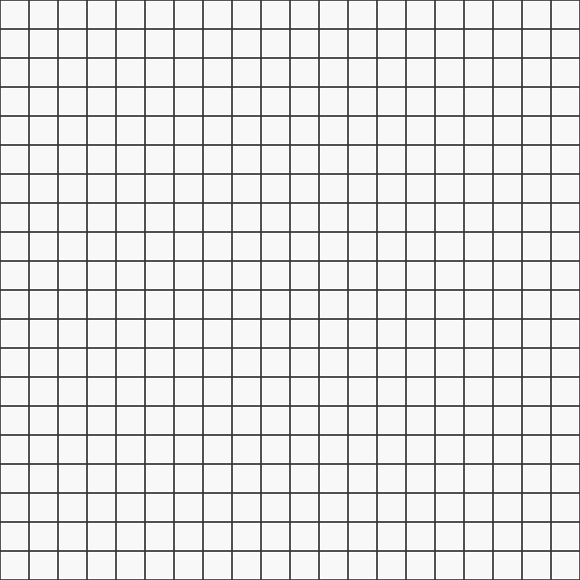
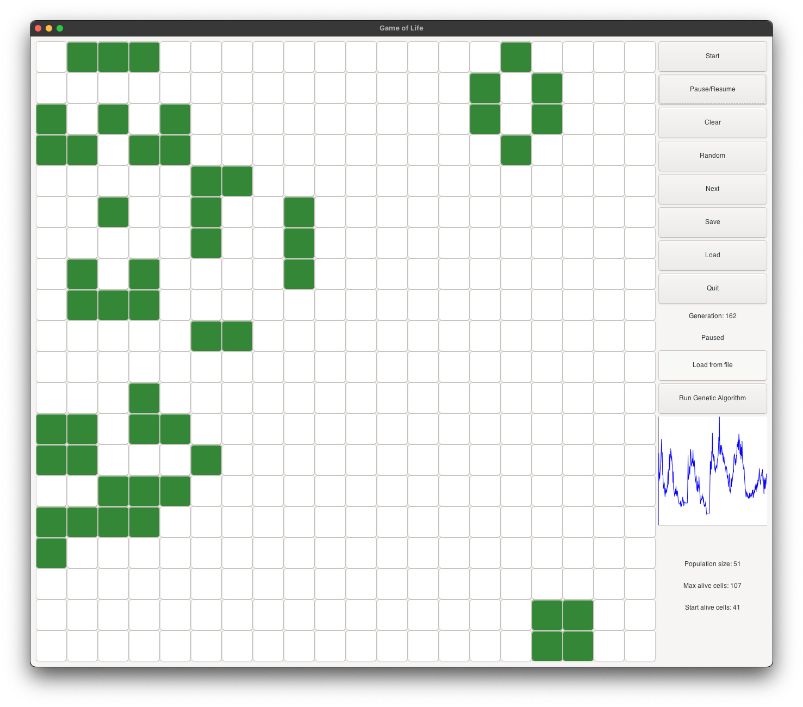
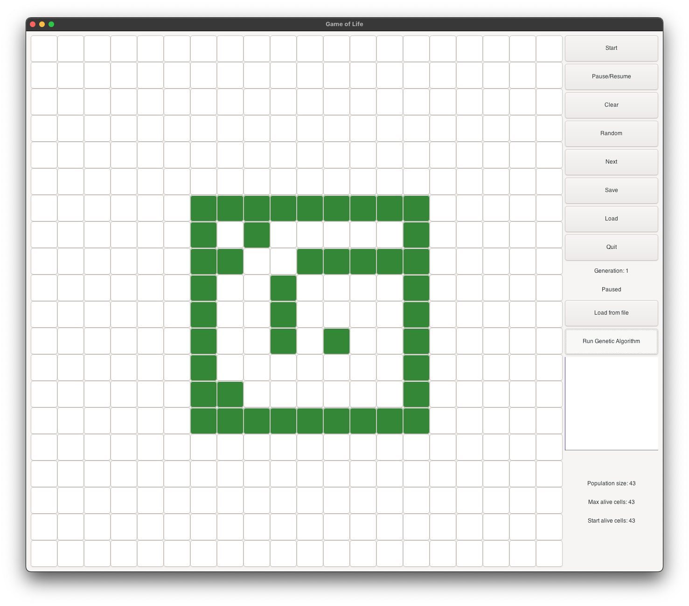
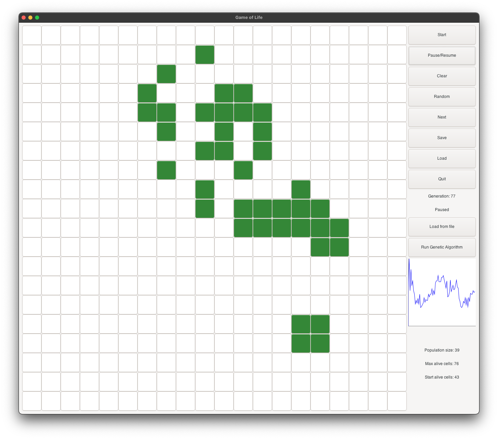
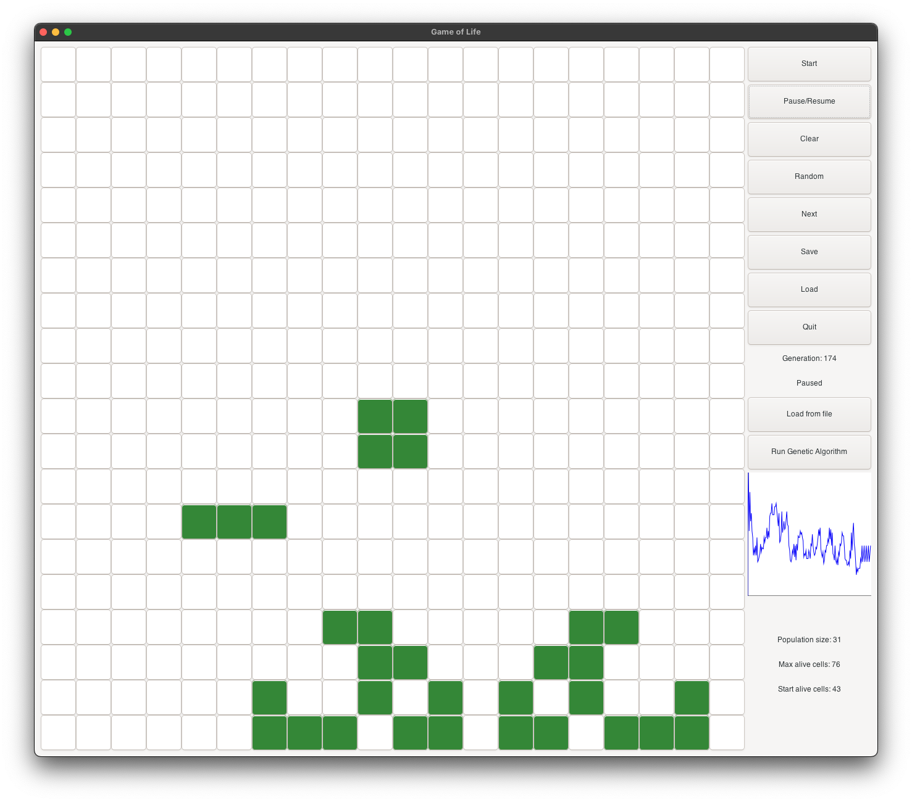

# Genetic Algorithm for Conway's Game of Life 🧬

This project implements a genetic algorithm to discover configurations in Conway's Game of Life that meet specific criteria, showcasing the power of AI in software development. The project developed for the **Biological Computation (20581)** Advanced Course at the _Open University of Israel_ in 2024 and earned a perfect score of `100`.

<p align = "center">
    
    <br>
    <i>Dragon Shape Evolution</i>
</p>

---

<!-- @import "[TOC]" {cmd="toc" depthFrom=2 depthTo=4 orderedList=false} -->

<!-- code_chunk_output -->

- [Overview](#overview)
  - [Background](#background)
    - [Game of Life](#game-of-life)
    - [Evolutionary Algorithms](#evolutionary-algorithms)
  - [Project Objectives](#project-objectives)
  - [Project Structure](#project-structure)
- [Technical Details](#technical-details)
  - [Game of Life Implementation](#game-of-life-implementation)
    - [Static Board Padding](#static-board-padding)
    - [Efficient Update Process](#efficient-update-process)
  - [Chromosome Representation](#chromosome-representation)
    - [Initial State](#initial-state)
    - [Crossover (The Binary Genetic Operator)](#crossover-the-binary-genetic-operator)
    - [Mutation](#mutation)
    - [Evaluation Function](#evaluation-function)
    - [Fitness vs Score](#fitness-vs-score)
  - [Population Implementation](#population-implementation)
    - [Crossover (Reproduction Part)](#crossover-reproduction-part)
  - [GeneticAlgorithm Implementation](#geneticalgorithm-implementation)
    - [Roulette Wheel Selection](#roulette-wheel-selection)
    - [Report](#report)
    - [Save](#save)
  - [GUI](#gui)
- [Getting Started](#getting-started)
  - [Using the GUI](#using-the-gui)
    - [Running the Algorithm](#running-the-algorithm)
  - [Using the Command Line](#using-the-command-line)
- [Examples](#examples)
  - [Selected Individuals Showcase and Insights](#selected-individuals-showcase-and-insights)
  - [T_shape](#t_shape)
  - [Dragon](#dragon)
  - [Other Examples](#other-examples)
  - [Insights](#insights)
- [Contributions and Feedback](#contributions-and-feedback)
- [Acknowledgements](#acknowledgements)
- [License](#license)

<!-- /code_chunk_output -->

---

## Overview

### Background

#### Game of Life

The `Game of Life` is a cellular automaton devised by the British mathematician John Horton Conway in 1970. It is a zero-player game, meaning that its evolution is determined by its initial state, requiring no further input. The game unfolds on an infinite two-dimensional grid, with each cell in the grid being either alive or dead. The game progresses through generations, with each generation determined by the previous one according to a set of rules. These rules are as follows:

1. **Underpopulation:** Any live cell with fewer than two live neighbors dies, as if by underpopulation.
2. **Survival:** Any live cell with two or three live neighbors lives on to the next generation.
3. **Overpopulation:** Any live cell with more than three live neighbors dies, as if by overpopulation.
4. **Reproduction:** Any dead cell with exactly three live neighbors becomes a live cell, as if by reproduction.

For more information on the Game of Life, you can visit the [Wikipedia page](https://en.wikipedia.org/wiki/Conway's_Game_of_Life).

#### Evolutionary Algorithms

The concept of an `Evolutionary algorithm` encompasses a group of algorithms inspired by evolution to solve various problems, primarily optimization problems, although not limited to them. The core idea involves initializing a population of potential solutions and leveraging an evolution-inspired process to refine this population based on the principle of `survival of the fittest`. Initially, each solution in the population undergoes evaluation using a fitness function to assess its quality and likelihood for selection in subsequent generations. The next generation is then formed by selecting the best solutions from the current generation and subjecting them to `crossover` and `mutation` operations. This iterative process continues until predefined criteria are met. Key characteristics of evolutionary algorithms include `simultaneous evolution of a solution population`, incorporation of `crossover mechanisms`, and introducing `stochasticity` in the optimization process.

A `Genetic algorithm` represents a specific instance within the evolutionary algorithm family, emphasizing `selection`, `crossover` or `recombination`, and `mutation` operations to refine the solution population. As highlighted in the book, genetic algorithms typically prioritize the `crossover` phase over `mutation`. Additionally, they commonly employ `binary` representations for solutions and utilize fitness functions to evaluate solution quality, although alternative representations may sometimes yield better results. Genetic algorithms leverage individuals for exploring new solution directions while preserving promising solutions. They are particularly effective in identifying promising areas within the search space rather than focusing solely on finding the optimal solution within those regions.

`Genetic Programming` constitutes an evolutionary computation model where solutions are represented as programs, often structured as trees. The distinctive aspect lies in the genetic operations performed on these program representations. Mutation involves altering the tree structure, while crossover entails swapping subtrees. Genetic programming incorporates the concepts of `terminals set` and `functions set`, where the former encompasses all possible terminals in the tree, and the latter includes all possible functions. Another notable difference lies in the chromosome representation: genetic programming may involve trees of varying sizes, contrasting with genetic algorithms where chromosomes typically have uniform sizes.

### Project Objectives

The program utilising a genetic algorithm in order to discover configurations in Conway's Game of Life that meet the following criteria:

1. **Reach a Stable State:** The configuration must end in a state that is static or oscillating, containing at least one live cell.
2. **Long Evolution Time:** The configuration should take a considerable amount of time to reach stability.
3. **Expansion Before Stability:** During evolution, the configuration must expand significantly beyond its initial size.

This kind of patterns are known as `Metuselahs` in the Game of Life terminology. The project aims to explore the potential of genetic algorithms in discovering such configurations, showcasing the power of AI in software development. For more about `Metuselahs`, you can visit the [Wikipedia page](https://en.wikipedia.org/wiki/Methuselah_(cellular_automaton)).

### Project Structure

The implementation is modular, consisting of:

- **Game Logic**: `game.cpp` - A Game of Life implementation optimized for speed, using C-style memory management for efficiency.
- **Chromosome Representation**: `chromosome.cpp` - Encapsulates a configuration within the game, implementing genetic operations like crossover and mutation.
- **Genetic Algorithm Core**: `ga.cpp` & `population.cpp` - The heart of the genetic algorithm, handling the population of configurations and their evolution over generations.
- **GUI**: `gui.cpp` - An advanced graphical user interface for real-time visualization of the algorithm's progress.
- **Main Application**: `main.cpp` - Orchestrates the execution of all components.

---

## Technical Details

### Game of Life Implementation

This section delves into the technical implementation of the Game of Life, highlighting specific optimizations. For details on the Genetic Algorithm implementation, please see the subsequent section.

#### Static Board Padding

To mitigate edge-related anomalies and simulate an infinite board, the implementation employs static padding around the board. This method enhances the simulation's realism by ensuring edge cells have an equal opportunity for evolution as those in the center.

```cpp
static int paddingRows[BOARD_SIZE + 2][BOARD_SIZE + 4];

// Ensure the board is only copied if there are differences
for (int row = 0; row < BOARD_SIZE; row++) {
    if (memcmp(paddingRows[row + 2] + 2, board[row], BOARD_SIZE * sizeof(int)) != 0) {
        for (int r = 0; r < BOARD_SIZE; r++) {
            memcpy(paddingRows[r + 2] + 2, board[r], BOARD_SIZE * sizeof(int));
        }
        memset(paddingRows[0], 0, (BOARD_SIZE + 4) * sizeof(int));
        memset(paddingRows[1], 0, (BOARD_SIZE + 4) * sizeof(int));
        memset(paddingRows[BOARD_SIZE + 2], 0, (BOARD_SIZE + 4) * sizeof(int));
        memset(paddingRows[BOARD_SIZE + 3], 0, (BOARD_SIZE + 4) * sizeof(int));
        break;
    }
}
```

This padding strategy not only simplifies the edge case handling but also optimizes memory usage by avoiding unnecessary copies of the board. The comparison step ensures the board is only updated when changes occur, reducing computational overhead.

#### Efficient Update Process

The update mechanism employs a two-bit strategy to encode both the current and next states of each cell within a single integer. This approach eliminates the need for a separate buffer to hold the next state, thereby halving memory usage and improving performance.

```cpp
// Apply game rules and set the next state in the second bit
for (int row = 2; row < BOARD_SIZE + 2; row++) {
    for (int col = 2; col < BOARD_SIZE + 2; col++) {
        int liveNeighbors = calculateLiveNeighbors(paddingRows, row, col);
        if (paddingRows[row][col] & 1) { // Current state is alive
            if (liveNeighbors == 2 || liveNeighbors == 3)
                paddingRows[row][col] |= 2; // Survives
        } else { // Current state is dead
            if (liveNeighbors == 3)
                paddingRows[row][col] |= 2; // Becomes alive
        }
    }
}

// Finalize the state transition by shifting bits
for (int row = 2; row < BOARD_SIZE + 2; row++) {
    for (int col = 2; col < BOARD_SIZE + 2; col++) {
        paddingRows[row][col] >>= 1; // Complete the transition
        board[row - 2][col - 2] = paddingRows[row][col] & 1; // Update the main board
    }
}
```

This bit manipulation technique allows for an in-place update of the board state, significantly optimizing the simulation's performance.

Inspiration for this optimization came from solving a related problem on LeetCode, where I first encountered Conway's Game of Life. You can explore my solution, originally written in C, in my December 2023 LeetCode post [here](https://leetcode.com/problems/game-of-life/solutions/4383051). If you find the approach insightful, I would appreciate your upvote.

**Note:** The board utilizes a fixed-size array (`int [size][size]`), chosen for its simplicity and efficiency due to compile-time size knowledge and contiguous memory allocation. Adjusting the `BOARD_SIZE` macro in [config.hpp](config.hpp) allows for easy size modifications.

---

### Chromosome Representation

The `Chromosome` class encapsulates a configuration of Conway's Game of Life.

#### Initial State

The initial population is generated by the `Population` class through the `Chromosome` default constructor, which creates a random configuration at the board's center. This task proved more complex than anticipated. The challenge was to ensure the initial configuration was random, yet small and diverse. My solution involved:

1. Selecting an `aliveProbability` parameter (detailed in [config.hpp](config.hpp)). This parameter dictates the likelihood of each cell being alive.

2. Defining lambda functions to outline basic shapes: `square`, `circle`, and `triangle`. These functions accept cell coordinates and return `true` if the cell resides on the shape's border, and `false` otherwise.

3. Adjusting weights for each shape to mitigate biases, as certain shapes tended to have a higher probability of containing alive cells, which I aimed to avoid.

4. Choosing a random shape.

5. Iterating over the board, setting each cell within the chosen shape's border to be alive based on the `aliveProbability`.

**Note:** By confining the initial configuration to the middle of the board, I've effectively reduced the search space. According to the assignment's requirements, we are permitted to assume a finite space. Additionally, I implemented dynamic sizes and tested the algorithm on various board sizes. The size factor can be adjusted by modifying the `BOARD_SIZE` macro in [config.hpp](config.hpp). However, it is recommended to maintain a value of `20` to guarantee optimal results.

#### Crossover (The Binary Genetic Operator)

Crossover implementation in the `Chromosome` class constructor:

```cpp
 Chromosome(std::shared_ptr<Chromosome> parent1,
      std::shared_ptr<Chromosome> parent2);
```

After thorough testing of various crossover methods, I opted to forgo the `point` crossover method described on pages 94-95 of the book (Biological Computation). Instead, I chose the `uniform` crossover approach. This method is encapsulated within the `Chromosome` class constructor. The constructor accepts two parent chromosomes and generates a new chromosome by randomly selecting each cell's state from one of the two parents.

```cpp
    for (int row = 0; row < BOARD_SIZE; row++) {
        for (int col = 0; col < BOARD_SIZE; col++) {
            if (rand() % 2 == 0) {
                board[row][col] = parent1->board[row][col];
            } else {
                board[row][col] = parent2->board[row][col];
            }
        }
    }
```

Example to crossover (`aliveProbability` is 100% for this example):


Note that the `crossoverPointX` ctor is also implemented, and you can use it by calling the following constructor:

```cpp
Chromosome(int crossoverPoint, std::shared_ptr<Chromosome> parent1,
      std::shared_ptr<Chromosome> parent2);
```

#### Mutation

The mutation process is uniquely orchestrated outside the `Chromosome` class, specifically within the `Population` class through a `mutation` method. This method requires a `mutationRate` parameter and applies mutations across the population with a probability determined by this rate. The mutation operation involves randomly selecting a cell (or Gene) within a chromosome and toggling its state.

This design choice, to situate the mutation functionality outside of the `Chromosome` class, is strategic. It allows for a comprehensive application of mutations across all chromosomes within the population, rather than restricting mutation to individual chromosomes. This approach ensures that the mutation process can consider the entire population's genetic diversity when applying changes.

The mutation methodology employed here aligns with the `uniform` mutation strategy as discussed on page 95 of the book (Biological Computation). By applying mutations uniformly across the population, this method enhances the likelihood of generating viable and diverse genetic configurations.

An important aspect of our mutation strategy is its focus on the central region of the chromosome for mutation application. This focused approach ensures that mutations have a meaningful impact on the genetic configuration, thereby supporting the generation of viable and diverse outcomes. The following code snippet illustrates how mutations are specifically applied to the central region of the chromosome:

```cpp
void Population::mutation(double mutationRate) {
 // Random mutation based on mutation rate
 for (auto &individual : chromosomes) {
  for (int i = 0; i < BOARD_SIZE; i++) {
   for (int j = 0; j < BOARD_SIZE; ++j) {
     if ((rand() / (double)RAND_MAX) < mutationRate) {
      individual->board[i][j] =
       1 - individual->board[i][j]; // Flips the bit
     }
    }
   }
  }
}
```

#### Evaluation Function

To pinpoint the desired configurations, a specialized evaluation function was crafted, encapsulated within the `calculateScore` method. This function draws upon three critical insights:

1. The longer it takes for the configuration to reach a stable state, the more favorable it is.
2. The larger the configuration grows during its evolution, the better.
3. The smaller the initial configuration, the more advantageous.

These principles are operationalized in the evaluation process, where each chromosome undergoes a simulation spanning 500 generations. For every generation a chromosome remains stable, it earns +1 to its score. Post-simulation, the score is determined by the formula: `std::max(1, maxAlive - static_cast<int>(startAlive*2.2) + stablePeriod);`. Here, `maxAlive` is granted a 100% bonus to promote the development of larger configurations—a decision reached after extensive testing. Conversely, `startAlive` incurs a 120% penalty to favor smaller starting configurations, while `stablePeriod` enjoys a 100% bonus, incentivizing longer-lasting simulations. The use of `std::max(1, ...)` ensures that scores do not dip into the negative.

Stable states are detected using `prevAlive` and `curAlive` variables, alongside a `pastStates` hash table. The `pastStates` table checks if a current state has previously occurred by transforming the board into a run-length encoded string, converting sequences like `0 0 0 0 1 1 1 0 0 0 0 0 0 0 0 0 1 1 1 1` into `0#4 1#3 0#7 1#4`. This encoding significantly reduces the hash table's size and accelerates comparisons. While `prevAlive` and `curAlive` could also indicate stability, employing the hash table method is markedly more efficient.

#### Fitness vs Score

In the context of genetic algorithms within this program, each chromosome is characterized by two distinct attributes: `score` and `fitness`. The `score` reflects the chromosome's performance in the simulation, serving as a measure of its effectiveness in reaching desirable states. On the other hand, `fitness` quantifies the likelihood of a chromosome being chosen for reproduction in the subsequent generation.

The calculation of `fitness` is derived from the `score` of an individual chromosome in relation to the aggregate score of the entire population. Specifically, `fitness` represents a proportion of the total score, ensuring that chromosomes with superior scores are accorded higher fitness values. Consequently, these chromosomes stand a better chance of being selected for the next generation, aligning with the principle that the fittest individuals have the greatest likelihood of survival and reproduction.

---

### Population Implementation

The `Population` class encapsulates a collective of `Chromosome` instances, managing their lifecycle and evolutionary processes. Implemented in [population.cpp](population.cpp), this class oversees a vector of chromosomes, `std::vector<std::shared_ptr<Chromosome>> chromosomes`, handling tasks such as selection and crossover to foster the development of successive generations.

Selection within the population is governed by `selectionPressure` and `selectionMethod` parameters. `selectionPressure` dictates the count of chromosomes to be selected, while `selectionMethod` determines the technique of selection. These selection strategies are detailed in the `GeneticAlgorithm` class, which will be explored further.

#### Crossover (Reproduction Part)

To regenerate the population for the next generation, the `Population` class leverages the `Chromosome` API, utilizing `selectionPressure` and the chosen selection method to guide the process. This design ensures versatility, enabling the class to support a wide array of problems beyond the specific challenge addressed by this program. The aim is to foster a generic, adaptable framework for genetic algorithm applications.

```cpp
void Population::crossover() {
 // create a new population
 std::vector<std::shared_ptr<Chromosome>> newPopulation;

 // Generate new individuals until the new population is full
 while (static_cast<int>(newPopulation.size()) < populationSize) {
  // Select two parents
  int parent1Id = rand() % chromosomes.size();
  int parent2Id = rand() % chromosomes.size();

  // Perform crossover
  std::shared_ptr<Chromosome> parent1 = chromosomes[parent1Id];
  std::shared_ptr<Chromosome> parent2 = chromosomes[parent2Id];

  auto offspring = getOffsprings(parent1, parent2);

  // Add the new individuals to the new population
  newPopulation.push_back(offspring[0]);
  newPopulation.push_back(offspring[1]);

  // If the new population is not full, add the fittest parent to the new
  // population
  if (newPopulation.size() < chromosomes.size()) {
   newPopulation.push_back(chromosomes[parent1Id]);
  }
 }

 // Replace the old population with the new population
 chromosomes = newPopulation;
}
```

`GetOffsprings` simple calls the `Chromosome` constructor with the two parents that were selected from the `survivors` selected by the `selection` method. The process is repeated until the new population is full.

After each generation is created - including the initial one, the `calculateScore` method is called on each chromosome to calculate its score.

The method updates the fitness of each chromosome based on the score and the total score of the population. The fitness is calculated by the following formula: `fitness = score / totalScore`.

```cpp
 // update the fitness score for each chromosome
 for (auto chromosome : chromosomes) {
  chromosome->calculateFitness(static_cast<double>(totalFitnessScore));
 }
 ```

 Note that due to the way the rouletteWheelSelection method is implemented, the totalFitnessScore is actually the totalScore of the population.

 Because it takes for each chromosome its score, in relation to the total score, the fitness is actually a percentage of the total score. This way, the chromosomes with the highest scores get the highest fitness, and the chromosomes with the lowest scores get the lowest fitness.

---

### GeneticAlgorithm Implementation

The `GeneticAlgorithm` is imlemented based on the psudo-code describe in p. 131 of the book (Biological Computation). The class is implemented in [ga.cpp](ga.cpp). The class is responsible for running the genetic algorithm on the population of chromosomes.

The main process is implemented in the `run` method.

```cpp
void GeneticAlgorithm::run() {
 while (population->generation < maxGenerations) {
  population->calculateTotalScore();
  report();
  population->selection(selectionPressure,
         &GeneticAlgorithm::rouletteWheelSelection);
  population->crossover();
  population->mutation(mutationRate);
  population->generation++;
 }
 population->calculateTotalScore();
 save();
 printSummary();
}
```

#### Roulette Wheel Selection

After testing different kinds of selection methods, I've decided to use the `Roulette Wheel Selection` method. This method is implemented in the `GeneticAlgorithm` class. The method is implemented in the `selection` method. The method gets the `selectionPresure` parameter and returns a vector of selected chromosomes.

```cpp
void GeneticAlgorithm::rouletteWheelSelection(
 std::vector<std::shared_ptr<Chromosome>> &chromosomes, int survivorsSize) {
 std::vector<int> cumulativeScores(chromosomes.size());
 int totalScore = 0;
 for (int i = 0; i < static_cast<int>(chromosomes.size()); i++) {
  totalScore += chromosomes[i]->score;
  cumulativeScores[i] = totalScore;
 }

 std::vector<std::shared_ptr<Chromosome>> survivors;
 while (survivors.size() < survivorsSize) {
  int random = rand() % totalScore;
  auto it = std::lower_bound(cumulativeScores.begin(),
           cumulativeScores.end(), random);
  int index = std::distance(cumulativeScores.begin(), it);
  survivors.push_back(chromosomes[index]);
 }
 chromosomes = survivors;
}
```

Note that the `selectionPressure` parameter is used to determine the number of chromosomes to select (`survivorsSize`) by applying the following formula: `survivorsSize = (int)(chromosomes.size() * selectionPressure)`.

#### Report

The `report` method is designed to provide a visually engaging overview of the algorithm's progress. Initially, I utilized `csv` files for tracking, but later transitioned to real-time console output for a more dynamic observation experience. Given the algorithm's rapid execution, the progress visualization resembles a fast-forward movie.

The `bestChromosome` is displayed in an accessible format, utilizing square (`■`) and space symbols to represent different states or values.

I encourage you to experience the evolution process in real-time. For a demonstration, please refer to attachment A.

#### Save

The `save` method facilitates the preservation of algorithm outcomes. Each member of the final population is saved into a `.txt` file, prioritized by performance with the file names reflecting the score of the individual. Additionally, a comprehensive `report.txt` file compiles the algorithm's parameters, the concluding population, and a summary of the process. The report delineates each individual with detailed descriptions and includes command line instructions for replicating the experiment with specific individuals. An example can be found in attachment B.

---

### GUI

Implemented in `gui.cpp`, the graphical user interface (GUI) leverages the `gtk` library to offer an intuitive user experience. It features real-time game display, showcasing metrics such as the current generation, initial and current alive cells, and the top score. A graphical representation of the population size is also included, with options for manual or automatic algorithm execution.



Users have the flexibility to initiate runs from the GUI or via command line arguments. Post-execution, a new window presents the final generation, with navigation through different individuals enabled by the `load from file` button.

**Note**: The GUI prompts for a directory and memorizes the last accessed location, streamlining subsequent runs within the same directory without the need for reselection. Command line executions automatically recall and open the last used directory.

## Getting Started

The program can be executed from the command line or via the GUI. The following instructions detail both approaches.

### Using the GUI

Ensure the `gtk` library is installed on your system. If absent, it can be installed with the following command:

```bash
sudo apt-get install libgtk-3-dev
```

or on mac:

```bash
brew install gtk+3
```

The program can be compiled with the included `makefile` by running the following command:

```bash
make
```

#### Running the Algorithm

Post-activation of the `Run Genetic Algorithm` button and subsequent algorithm completion, the user is presented with the following interface sequence:

|  |  |
|:--:|:--:|
|  |  |
|  |  |

Additionally, a `save` function is integrated, allowing current configurations to be archived as `.txt` files within the `saves` directory for future access. This feature is complemented by a `Load` button for convenient retrieval of these saved configurations.

### Using the Command Line

Note that the program can also be run without the GUI. In such cases, output is directed to the console, and results are saved as `.txt` files within the `populations` directory. This approach was chosen to ensure program accessibility on any machine, regardless of the presence of the `gtk` library, and to maintain output configuration flexibility.

A notable drawback of this method is the storage inefficiency for `sparse matrices` in the `populations` directory. In different scenarios, encoding these matrices would be a practical solution to conserve space. However, for this specific application, the sparse matrices represent the desired output, making their direct storage justifiable.

---

## Examples

### Selected Individuals Showcase and Insights

The evaluation of two distinct individuals, namely the `T_shape` and the `Dragon` shape, provides insightful observations into the algorithm's performance. The `T_shape` emerges as an intriguing pattern, while the `Dragon` shape captivates with its evolutionary complexity. These shapes frequently recur across various individuals, highlighting their significance within the genetic algorithm's exploration space.

To explore these examples firsthand, utilize the GUI's `Load` button to access the `saves` directory or execute the following commands:

```bash
./met saves/dragon.txt
```

```bash
./met saves/t_shape.txt
```

### T_shape

<p align = "center">
    
</p>

`T_shape` is called after the mighty T-rex, and its `T` shape. The initial state starts with 6 alive cells. It is a very small shape, and it is very likely to be selected as a parent for the next generation. It evolves into a heart (see figure 2), and continues as a musk (see figure 3). It continues to evolve into a goat face (see figure 4), and then into a skull face (see figure 5). It continues to grow and become stable at generation 225 (see figure 6). At its peak, it has about 100 alive cells.

|  |  |
|:--:|:--:|
| _Figure 1: Initial State_ | _Figure 2: Heart Evolution_ |

|  |  |
|:--:|:--:|
| _Figure 3: Musk Evolution_ | _Figure 4: Goat Face Evolution_ |

|  |  |
|:--:|:--:|
| _Figure 5: Skull Face Evolution_ | _Figure 6: Stable State at Gen 225_ |

### Dragon

<p align = "center">
    
</p>

Dragon's initial state starts with 6 alive cells. It is a very small shape, and it is very likely to be selected as a parent for the next generation. It evolves into a dragon with open wings (see figure 2), and continues as a dragon with closed wings (see figure 3). It continues to evolve into a dragon with big open wings (see figure 4), and then into a dragon with very big open wings (see figure 5). It continues to grow and become stable at generation 132 (see figure 6). At its peak, it has about 10 times more alive cells than the initial shape.

|  |  |
|:--:|:--:|
| _Figure 1: Initial State_ | _Figure 2: Open Wings_ |

|  |  |
|:--:|:--:|
| _Figure 3: Closed Wings_ | _Figure 4: Big Open Wings_ |

|  |  |
|:--:|:--:|
| _Figure 5: Very Big Open Wings_ | _Figure 6: Stable State at Gen 132_ |

### Other Examples

The `hi` shape demonstrates a long evolution period of more than 230 generations and more than ten times bigger than the initial shape.


*Figure 7: Hi Shape Evolution*

You can see the population that led to those individuals under the [populations](populations) directory and explore their variations.

### Insights

The algorithm produced some interesting results. Here are more insights:

1. **Short simulation tends to produce better individuals**: This can be explained by the fact that mutations are most likely to turn cells alive than dead. This observation is based on the fact that the initial shapes are usually small, and the algorithm prefers to keep them small.

2. **Low `mutationRate` tends to produce better individuals**: This can be explained by the fact that the best individuals are usually consist of the same basic shapes - like the `T_shape` and the `Dragon` shape.

3. **The algorithm prefers symmetric shapes**: This can be explained by the fact that the evaluation function gives a bonus for bigger shapes. The bigger the shape is, the more likely it is to be symmetric.

4. **The algorithm parameters are affected by the size of the board**: This insight connects some parameters that at first sight might not seem related. For example, the number of simulations should align with the board size.

5. **Cycles Tracking**: To address undesired individuals surviving for a long time, a hash table that keeps track of visited boards during the simulation was added. To enhance performance, the boards are encoded into occurrences string, and the hash table is implemented as a `std::unordered_set<std::string>`.

## Contributions and Feedback

Feel free to fork this project, submit pull requests, or send me suggestions to improve the algorithm or the implementation. Your feedback is highly appreciated!

## Acknowledgements

This project was inspired by my continuous exploration of computational biology and my desire to blend software engineering with biological systems' complexity. Special thanks to my course instructors and peers for their invaluable insights and support.

## License

This project is licensed under the MIT License - see the [LICENSE](LICENSE) file for details.
